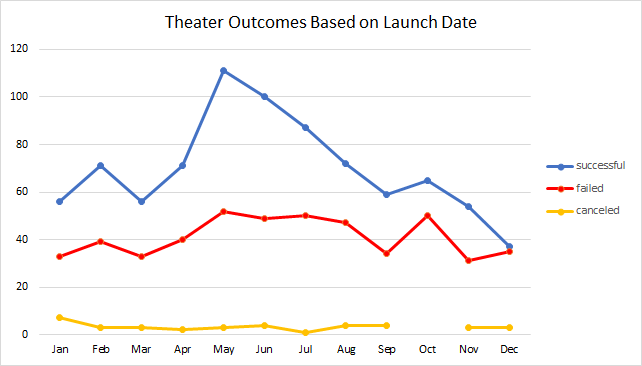

# An Analysis of Kickstarter Campaigns

## Overview of Project
This project analyzed several thousand crowdfunding projects to uncover any hidden trends. 

### Purpose
The purpose of this project was to assist an up-and-coming playwright, Louise, decide if her estimated campaign budget of $10,000 was a realistic goal to fund her play, *Fever*. Using data visualization and data analysis tools, we helped her to decipher and interpret the large data set. Ultimately, we made it possible for Louise to make sense of the raw data. 

## Analysis and Challenges

### Analysis of Outcomes Based on Launch Date
Does the release date influence the outcome? We performed an analysis of outcomes based on their launch date to answer this question for Louise. What we found is between the months of April and August you see the highest scores for both successful and failed campaigns. 

### Analysis of Outcomes Based on Goals
We sorted the campaign outcomes into three categories; Successful, Failed, and Cancelled. We set these against the set goal amounts ranging from less than $1,000 to $50,000 or more. Our investigation looked for any relation between the two elements. We found that the lower the goal, the higher the success rate.

 

### Challenges and Difficulties Encountered
Not every campaign captured in this data set had a backer. This could potentially make it difficult to see how feasible the set goals were. Also, the data in the Deadline and Launched_at columns contained Unix timestamps. This is not the most easily interpretable format. We created a column titled Date Created Conversion in which we used a formula to convert the data into day-month-year format. 

## Results
- What are two conclusions you can draw about the Outcomes based on Launch Date?
The spike for failed campaigns hits in October and successful campaigns spike in May. If you follow the trends, a launch date set just after the start of Spring through the end of Summer would be a wise range. It is advised to wait until after the drop in March to catch the rise in April, with the best results lying in the month of May. This is our peak successful month. 

- What can you conclude about the Outcomes based on Goals?
While most successful campaigns were those with lower goals, there was a range of goals that performed better than others. The percentage of success was highest when the goal was between $1,000 and $4,999.  

- What are some limitations of this dataset?
This dataset would benefit from including the total ticket sales, the demographics of those who purchased said tickets, and the timeline showing the purchase date and the release date. 

- What are some other possible tables and/or graphs that we could create?
In addition to the data visualizations included in this report, we could also create a table or graph to display the success rate of the parent and subcategories of these campaigns. Perhaps a chart to track the timeline of any given campaign would be desired. This is also something we could create. 

